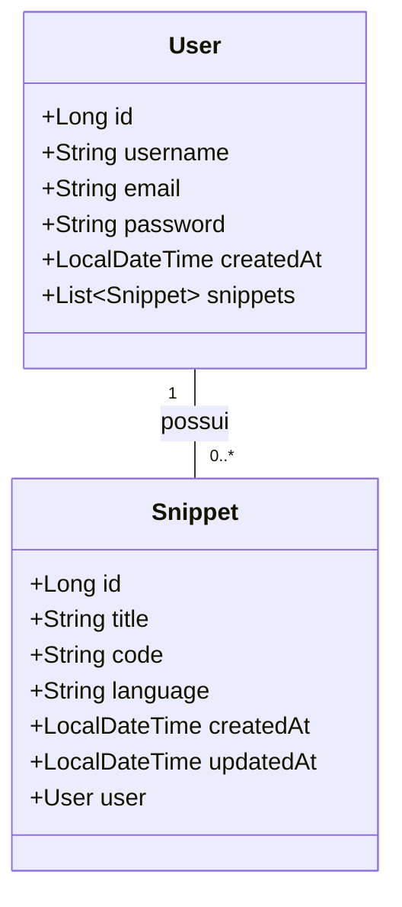

# DIO Bootcamp Decola Tech

Projeto de uma API RESTFul desenvolvida em Java com Spring boot. 
A minha API tem como objetivo fornecer um serviço onde os usuários possam armazenar, gerenciar e compartilhar pequenos trechos de código de diferentes linguagens de programação.

## Tecnologias Utilizadas

- Java 17
- Spring Boot
- Spring Data JPA
- OpenAPI (Swagger)
- Railway
- Spring Security
- Maven

## Diagrama de Classes

## Link para o deploy da aplicação

[Railway app](https://code-snippets.up.railway.app/swagger-ui/index.html)
